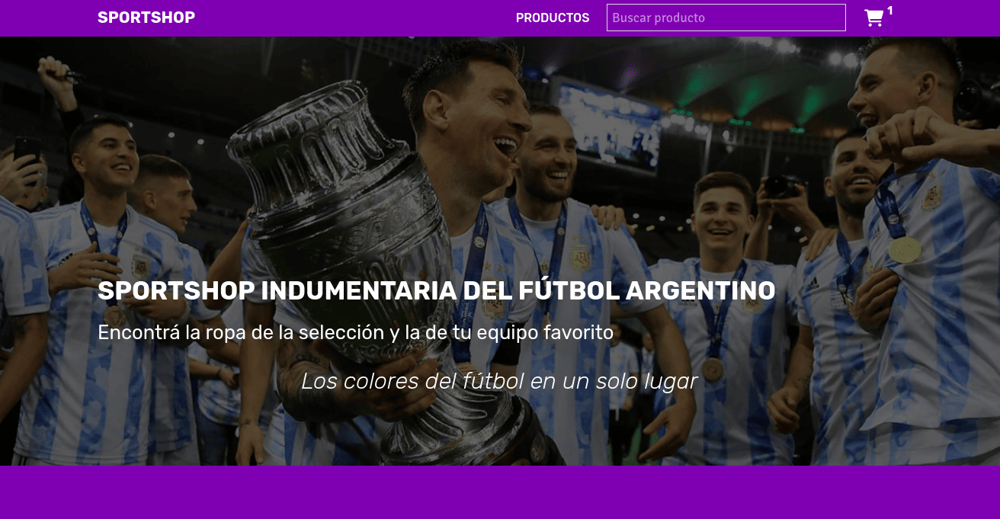
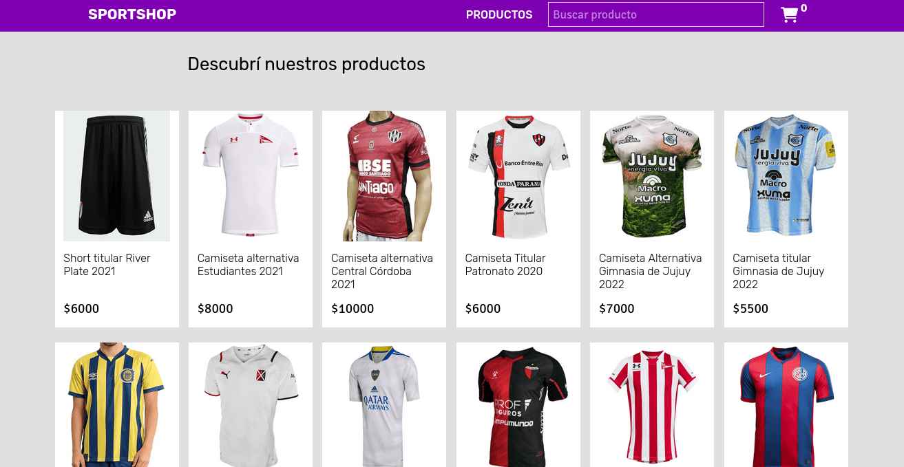
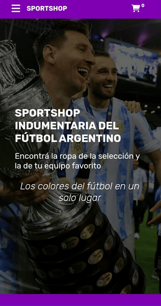
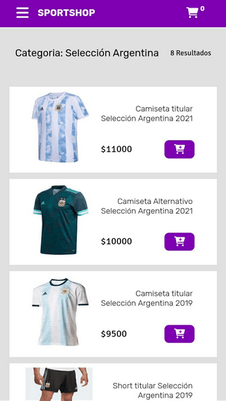
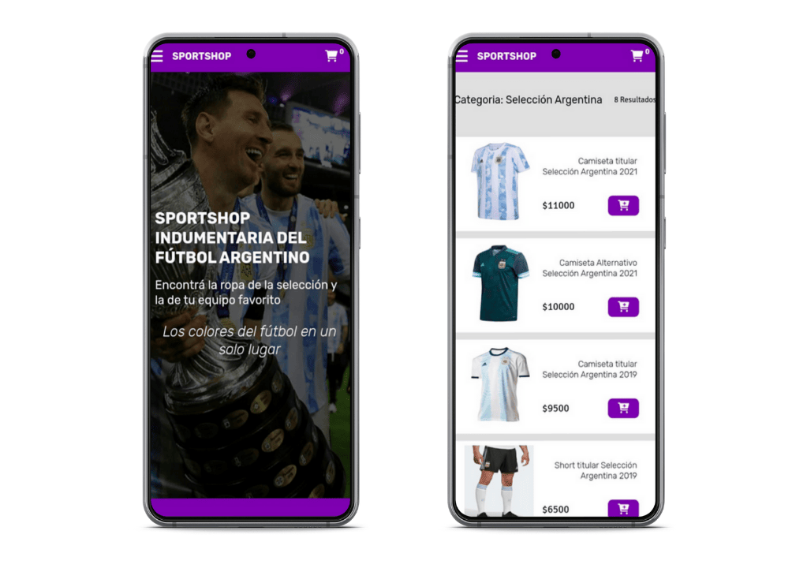

# SPORTSHOP - Indumentaria del fútbol Argentino

Hola :D 
En este repositorio encontrarás el diseño y desarrollo de un ecommerce de indumentaría deportiva, presentado como proyecto final para el curso de javascript en Coderhouse.

***

Las caracteristicas y funcionalidades del sitio son:
> * Diseño en base a paleta de colores.
> * Maquetado utilizando HTML5, CSS3 y SASS.
> * Diseño Full Responsive, para distintos dispositivos.
> * Lectura de datos desde un archivo JSON.
> * Carrito de compras, con vista de productos agregados y posibilidad de modificarlos.
> * Implementación de un formulario de busquedas de productos.
> * Uso de libreria 'Toastify Js'.
> * Filtros para la vista de productos [proximamente...]
> * Formulario de finalizar compra [proximamente...]

***

# Desktop

# Mobile 

# Ver Sitio

<a href="https://sportshoparg.netlify.app/"><h2>Sportshop</h2></a>

